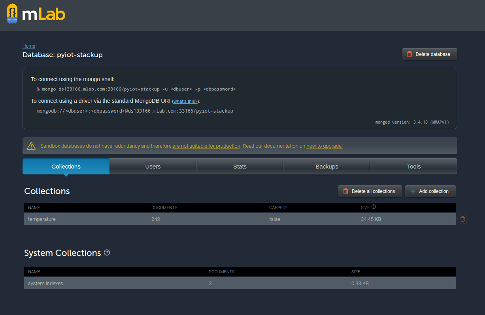
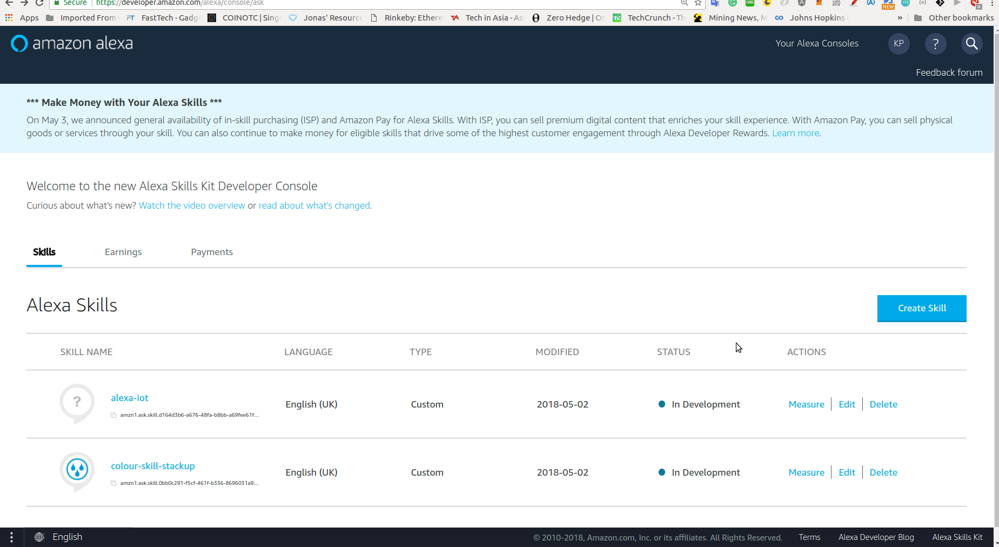
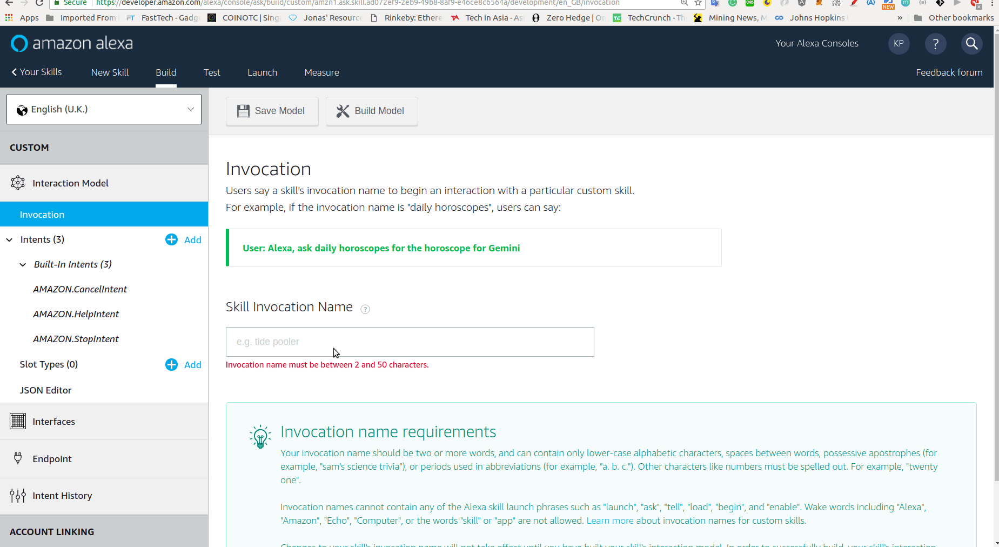
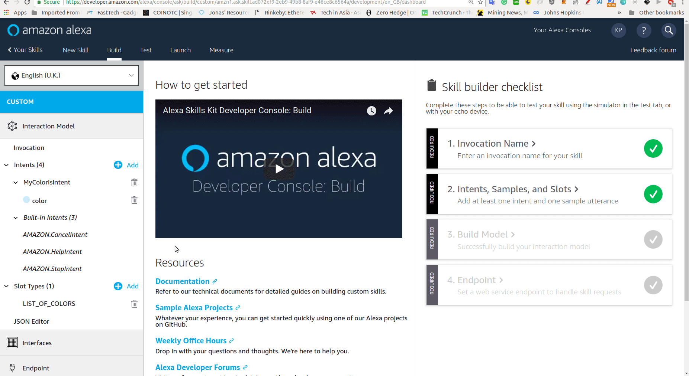
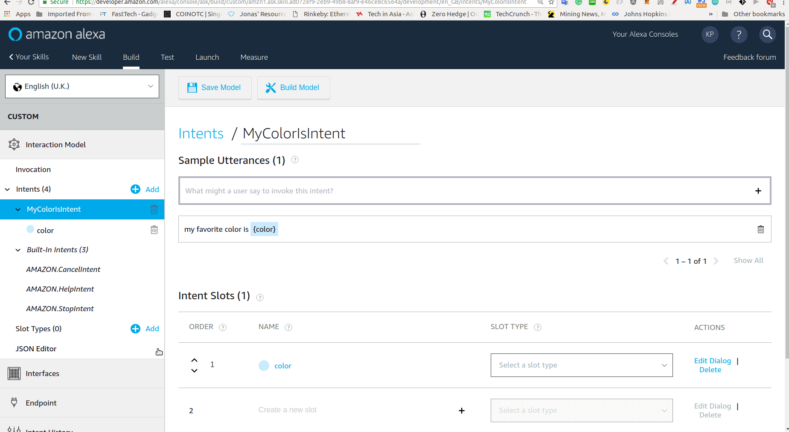
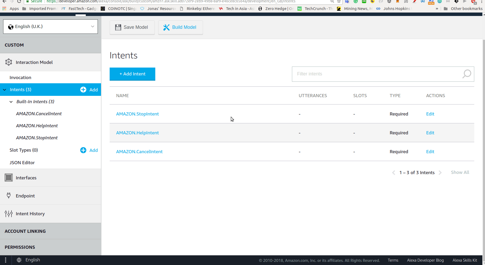
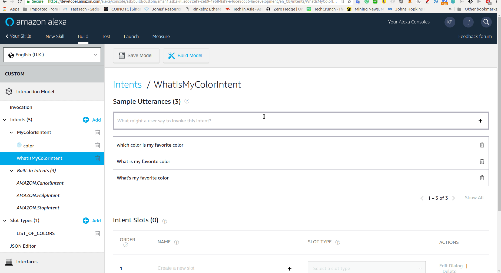
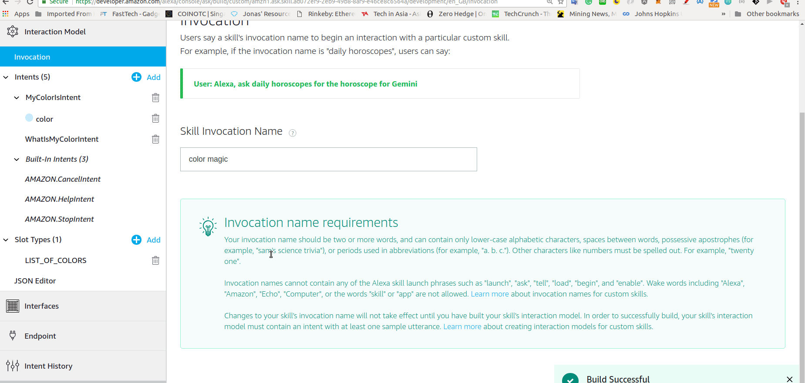

# Pre-requisite
* Amazon AWS Account (https://developer.amazon.com/alexa/console/)

* MongoDB mLab Account (https://mlab.com/login/?r=%2Fdatabases%2Fpyiot-stackup%2Fcollections%2Ftemperature)

* Launch Chrome , access the developer console page if you are a new user please register an account. If already existing amazon user login with your existing credential.




# Alexa Hello World

## Steps
1. Once you have logon to AWS Alexa Developer console.

2. Create a NEW Alexa Skill



3. Configure and allocate a unique skill invocation name for your newly created Alexa skill.




4. Create a two intents "WhatsMyColorIntent".

    * WhatsMyColorIntent's Utterances
        * what's my favorite color
        * what is my favorite color
        * Which is my favorite color



5. Create a slot type "LIST_OF_COLORS"
    * The slot values as below
        * green
        * red
        * blue
        * orange
        * gold
        * silver
        * yellow
        * black
        * white



6. Create a two intents "MyColorIsIntent" https://developer.amazon.com/docs/custom-skills/best-practices-for-sample-utterances-and-custom-slot-type-values.html#sample-utterance-phrasing
    * MyColorIsIntent's Utterances
        * my favorite color is {Color}




7. Build the model.



8. Navigate to the AWS console, create a python lambda function. After the lambda is created paste the following python codes into the in-line function code editor. * Runtime please select python version 2.7  (https://console.aws.amazon.com/console/home)

```python


from __future__ import print_function


# --------------- Helpers that build all of the responses ----------------------

def build_speechlet_response(title, output, reprompt_text, should_end_session):
    return {
        'outputSpeech': {
            'type': 'PlainText',
            'text': output
        },
        'card': {
            'type': 'Simple',
            'title': "SessionSpeechlet - " + title,
            'content': "SessionSpeechlet - " + output
        },
        'reprompt': {
            'outputSpeech': {
                'type': 'PlainText',
                'text': reprompt_text
            }
        },
        'shouldEndSession': should_end_session
    }


def build_response(session_attributes, speechlet_response):
    return {
        'version': '1.0',
        'sessionAttributes': session_attributes,
        'response': speechlet_response
    }


# --------------- Functions that control the skill's behavior ------------------

def get_welcome_response():
    """ If we wanted to initialize the session to have some attributes we could
    add those here
    """

    session_attributes = {}
    card_title = "Welcome"
    speech_output = "Welcome to the NUS Stackup Alexa App. " \
                    "Please tell me your favorite color by saying, " \
                    "my favorite color is red"
    # If the user either does not reply to the welcome message or says something
    # that is not understood, they will be prompted again with this text.
    reprompt_text = "Please tell me your favorite color by saying, " \
                    "my favorite color is red."
    should_end_session = False
    return build_response(session_attributes, build_speechlet_response(
        card_title, speech_output, reprompt_text, should_end_session))


def handle_session_end_request():
    card_title = "Session Ended"
    speech_output = "Thank you for trying the Alexa Skills Kit sample. " \
                    "Have a nice day! "
    # Setting this to true ends the session and exits the skill.
    should_end_session = True
    return build_response({}, build_speechlet_response(
        card_title, speech_output, None, should_end_session))


def create_favorite_color_attributes(favorite_color):
    return {"favoriteColor": favorite_color}


def set_color_in_session(intent, session):
    """ Sets the color in the session and prepares the speech to reply to the
    user.
    """

    card_title = intent['name']
    session_attributes = {}
    should_end_session = False

    if 'Color' in intent['slots']:
        print('in...')
        print(intent['slots']['Color'])
        favorite_color = intent['slots']['Color']['value']
        print(favorite_color)
        session_attributes = create_favorite_color_attributes(favorite_color)
        speech_output = "I now know your favorite color is " + \
                        favorite_color + \
                        ". You can ask me your favorite color by saying, " \
                        "what's my favorite color?"
        reprompt_text = "You can ask me your favorite color by saying, " \
                        "what's my favorite color?"
    else:
        speech_output = "I'm not sure what your favorite color is. " \
                        "Please try again."
        reprompt_text = "I'm not sure what your favorite color is. " \
                        "You can tell me your favorite color by saying, " \
                        "my favorite color is red."
    return build_response(session_attributes, build_speechlet_response(
        card_title, speech_output, reprompt_text, should_end_session))


def get_color_from_session(intent, session):
    session_attributes = {}
    reprompt_text = None
    print('responding...')
    print(session.get('attributes', {}) )
    print("favoriteColor" in session.get('attributes', {}))
    if session.get('attributes', {}) and "favoriteColor" in session.get('attributes', {}):
        favorite_color = session['attributes']['favoriteColor']
        speech_output = "Your favorite color is " + favorite_color + \
                        ". Goodbye."
        should_end_session = True
    else:
        speech_output = "I'm not sure what your favorite color is. " \
                        "You can say, my favorite color is red."
        should_end_session = False

    # Setting reprompt_text to None signifies that we do not want to reprompt
    # the user. If the user does not respond or says something that is not
    # understood, the session will end.
    return build_response(session_attributes, build_speechlet_response(
        intent['name'], speech_output, reprompt_text, should_end_session))


# --------------- Events ------------------

def on_session_started(session_started_request, session):
    """ Called when the session starts """

    print("on_session_started requestId=" + session_started_request['requestId']
          + ", sessionId=" + session['sessionId'])


def on_launch(launch_request, session):
    """ Called when the user launches the skill without specifying what they
    want
    """

    print("on_launch requestId=" + launch_request['requestId'] +
          ", sessionId=" + session['sessionId'])
    # Dispatch to your skill's launch
    return get_welcome_response()


def on_intent(intent_request, session):
    """ Called when the user specifies an intent for this skill """

    print("on_intent requestId=" + intent_request['requestId'] +
          ", sessionId=" + session['sessionId'])

    intent = intent_request['intent']
    intent_name = intent_request['intent']['name']

    # Dispatch to your skill's intent handlers
    if intent_name == "MyColorIsIntent":
        return set_color_in_session(intent, session)
    elif intent_name == "WhatsMyColorIntent":
        return get_color_from_session(intent, session)
    elif intent_name == "AMAZON.HelpIntent":
        return get_welcome_response()
    elif intent_name == "AMAZON.CancelIntent" or intent_name == "AMAZON.StopIntent":
        return handle_session_end_request()
    else:
        raise ValueError("Invalid intent")


def on_session_ended(session_ended_request, session):
    """ Called when the user ends the session.

    Is not called when the skill returns should_end_session=true
    """
    print("on_session_ended requestId=" + session_ended_request['requestId'] +
          ", sessionId=" + session['sessionId'])
    # add cleanup logic here


# --------------- Main handler ------------------

def lambda_handler(event, context):
    """ Route the incoming request based on type (LaunchRequest, IntentRequest,
    etc.) The JSON body of the request is provided in the event parameter.
    """
    print("event.session.application.applicationId=" +
          event['session']['application']['applicationId'])

    """
    Uncomment this if statement and populate with your skill's application ID to
    prevent someone else from configuring a skill that sends requests to this
    function.
    """
    # if (event['session']['application']['applicationId'] !=
    #         "amzn1.echo-sdk-ams.app.[unique-value-here]"):
    #     raise ValueError("Invalid Application ID")

    if event['session']['new']:
        on_session_started({'requestId': event['request']['requestId']},
                           event['session'])

    if event['request']['type'] == "LaunchRequest":
        return on_launch(event['request'], event['session'])
    elif event['request']['type'] == "IntentRequest":
        return on_intent(event['request'], event['session'])
    elif event['request']['type'] == "SessionEndedRequest":
        return on_session_ended(event['request'], event['session'])

```

<br>


9. Add "Alexa Skills Kit" trigger to the lambda function

10. Navigate back to te Alexa Skills Console go to endpoint copy the Skill ID and paste it to the lambda function.

9. Copy the Lambda function ARN and paste to the Alexa Skills console's endpoint and save model.



 
<br>
<hr>

<br>

# Alexa with Arduino temperature sensor

## Click the video below.

<a href="https://www.youtube.com/watch?v=vXw9tzfwlvw" target="_blank"></a>


## Objectives
* Ask Alexa which is hook to a custom made internet of things with temperature sensor to read out the room humidity and temperature .

## Load Arduino firmware to the development board
* Launch Arduino IDE
* Open the firmware/temperature_sensor.ino
* Compile 
* Sync to the Arduino board

## Python Dependencies
```
pip install flask
pip install flask_ask
pip install pymongo
pip install paho-mqtt
```
## Running all the program

```
python alexa-iot/arduino.py
python alexa-iot/server.py
python alexa-iot/device-broker.py
```


## Alexa Skills JSON Configuration
```
{
    "interactionModel": {
        "languageModel": {
            "invocationName": "iot stackup",
            "intents": [
                {
                    "name": "AMAZON.CancelIntent",
                    "samples": []
                },
                {
                    "name": "AMAZON.HelpIntent",
                    "samples": []
                },
                {
                    "name": "AMAZON.StopIntent",
                    "samples": []
                },
                {
                    "name": "RoomTempIntent",
                    "slots": [],
                    "samples": [
                        "room temperature",
                        "what is the temperature of this room",
                        "I feel cold do i need to wear extra jacket",
                        "Is hot here",
                        "Hey what is the room temperature"
                    ]
                }
            ],
            "types": []
        }
    }
}
```
